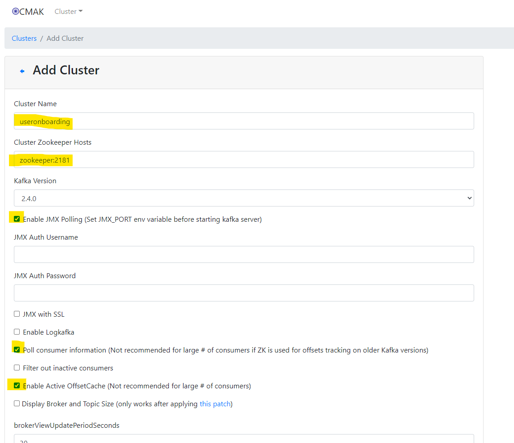

# Objective

Create a simple Docker Compose file to start up a Kafka local dev environment 

| Containers    | Name                  | Port      
| ------------- | --------------------- | ----------
| Zookeeper     | For accessing Kafka   | 2181:2181 
| Kafka         | the log               | 9092:9092 
| Kafka Manager | for managing Kafka    | 9000:9000 

# Pre-requisites

## Install Kafka + Zookeeper using Docker Compose
http://selftuts.com/kafaka-setup-using-docker-compose/

https://www.youtube.com/watch?v=WnlX7w4lHvM

http://selftuts.com/install-kafka-and-kafka-manger-using-docker-compose/

https://www.youtube.com/watch?v=enqqp2ZIEyE

### Tips

In the docker-compose.yaml file you'll need to update the following to use your local IP address: `KAFKA_ADVERTISED_HOST_NAME: [machine-ip-address]`

The "wurstmeister/kafka" image installs kafka in `~/opt/kafka` 

Start up in foreground: `docker-compose -f kafka-docker-compose.yml up`

Start up in background mode (detached): `docker-compose -f kafka-docker-compose.yml up -d`

To create a topic example: `./bin/kafka-topics.sh --create --zookeeper zookeeper:2181 --replication-factor 1 --partitions 1 --topic newuser`

To view all kafka topics: `./bin/kafka-topics.sh --list --zookeeper zookeeper:2181` 

View Kafka Manager with something like: http://192.168.0.167:9000

Kafka Manager initial configuration example: 

